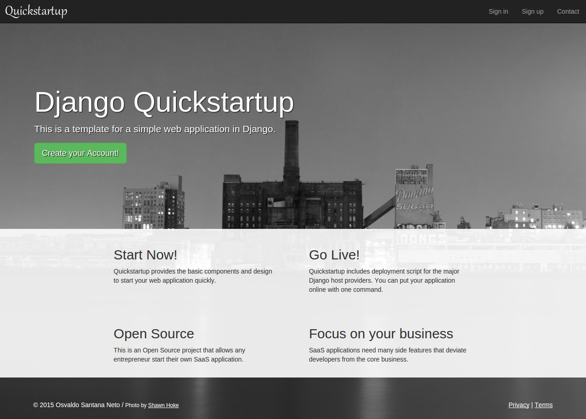
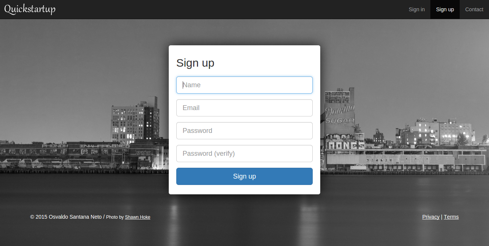
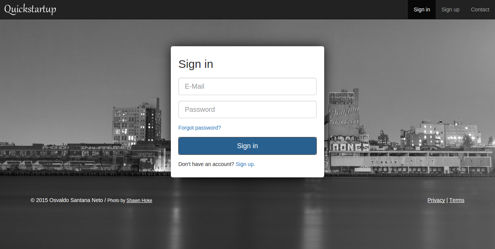
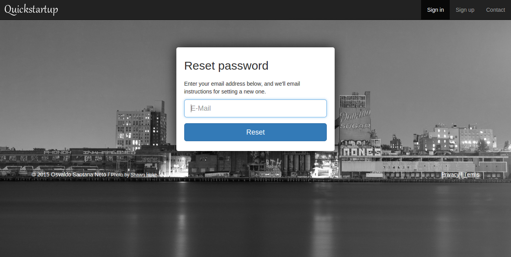
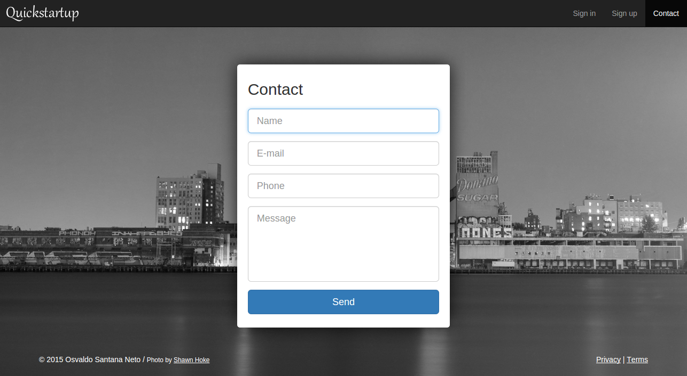
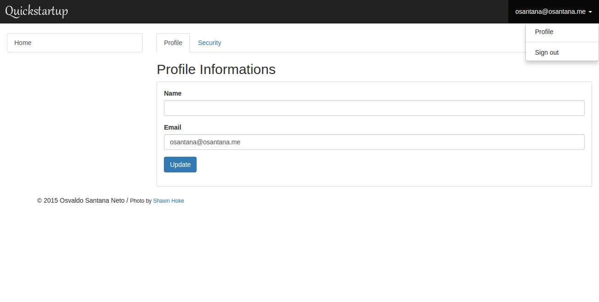

=============================
Quickstartup
=============================

.. image:: https://badge.fury.io/py/quickstartup.png
    :target: https://badge.fury.io/py/quickstartup

.. image:: https://travis-ci.org/osantana/quickstartup.png?branch=master
    :target: https://travis-ci.org/osantana/quickstartup

.. image:: https://coveralls.io/repos/osantana/quickstartup/badge.png?branch=master
    :target: https://coveralls.io/r/osantana/quickstartup?branch=master

Documentation
-------------

Quickstartup package used by `Quickstartup Template <https://github.com/osantana/quickstartup-template>`_

Screenshots
-----------

Landing Page
++++++++++++

    Landing Page

Signup Form
+++++++++++

    Signup form (you can easily customize it)

Signin Form
+++++++++++

    Signin form

Reset Password
++++++++++++++

    Reset Password

Contact Form
++++++++++++

    Contact Form

Sample App
++++++++++

    Sample Application showing user profile editor

TODO
----

* Decorators similar to "@login_required" that redirect user for signup/setup conclusion.
* Reorganize mail templates to make override possible
* Add address, map, and other infos in contact form
* Implement a custom RegistrationBackend to make code simple
* Make all e-mail sending async (no celery, please)
* Allow login e-mail address modification (with check for valid e-mail)
